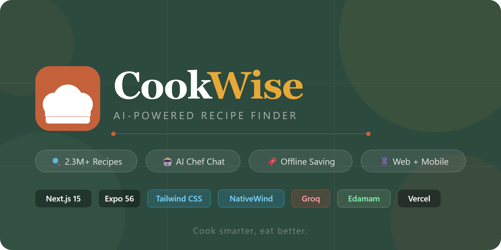

<div align="center">



# CookWise

**AI-powered recipe discovery & cooking assistant**

[](https://nextjs.org)
[](https://tailwindcss.com)
[](https://groq.com)
[](https://developer.edamam.com)
[](https://web.dev/progressive-web-apps)

[Live Demo](#) · [Report Bug](#) · [Request Feature](#)

---

</div>

## What is CookWise?

CookWise is a full-stack recipe app that combines **2.3 million recipes** from Edamam with an **AI cooking assistant** powered by Groq's Llama 3.3 70B. Search by ingredient, diet, or meal type — then ask the AI chef anything: substitutions, techniques, macros, or what to cook with what's in your fridge.

It works offline too. Save recipes to your device via IndexedDB and cook without a connection.

---

## Features

|     | Feature                   | Description                                                                  |
| --- | ------------------------- | ---------------------------------------------------------------------------- |
| 🔍  | **Smart Recipe Search**   | Edamam API (2.3M+ recipes), filter by meal type & dietary preference         |
| 🤖  | **AI Chef Assistant**     | Groq + Llama 3.3 70B — substitutions, tips, techniques, instant answers      |
| 📱  | **PWA & Offline Mode**    | Installable on iOS/Android, saved recipes work without internet              |
| 🔖  | **Save Recipes**          | Bookmark to IndexedDB — no account, no server, fully local                   |
| ✅  | **Interactive Checklist** | Check off ingredients as you cook                                            |
| 🎨  | **Custom Design System**  | Tailwind v4 with a warm food-forward palette and Playfair Display typography |
| 💬  | **Floating Chat Widget**  | Ask cooking questions from any page without leaving your recipe              |

---

## Tech Stack

| Layer           | Technology                                      |
| --------------- | ----------------------------------------------- |
| Framework       | Next.js 15 (App Router, Turbopack)              |
| Styling         | Tailwind CSS v4 + custom `@theme` design tokens |
| Recipe Data     | Edamam Recipe Search API v2                     |
| AI              | Groq API · Llama 3.3 70B Versatile              |
| Offline Storage | IndexedDB via custom `lib/db.ts`                |
| PWA             | Web App Manifest + service worker               |
| Language        | TypeScript                                      |

---

## Getting Started

### Prerequisites

- Node.js 18+
- A free [Edamam](https://developer.edamam.com/edamam-recipe-api) account
- A free [Groq](https://console.groq.com) account

### 1. Clone & install

```bash
git clone https://github.com/your-username/cookwise.git
cd cookwise/cookwise-web
npm install
```

### 2. Configure environment variables

```bash
cp .env.example .env.local
```

Open `.env.local` and fill in your keys:

```env
EDAMAM_APP_ID=your_edamam_app_id
EDAMAM_APP_KEY=your_edamam_app_key
GROQ_API_KEY=your_groq_api_key
```

### 3. Get your API keys

<details>
<summary><strong>Edamam (Recipe Search)</strong></summary>

1. Visit [developer.edamam.com](https://developer.edamam.com/edamam-recipe-api)
2. Sign up for a free account
3. Create an application → copy your **App ID** and **App Key**
4. Make sure you're on the **Recipe Search API v2** plan

Free tier: ~10,000 calls/month

</details>

<details>
<summary><strong>Groq (AI Chat)</strong></summary>

1. Visit [console.groq.com](https://console.groq.com)
2. Sign up (free, no credit card required)
3. Navigate to **API Keys** → create a new key

Free tier: very generous limits with extremely fast inference

</details>

### 4. Run locally

```bash
npm run dev
```

Open [http://localhost:3000](http://localhost:3000)

---

## Project Structure

```
cookwise-web/
├── app/
│   ├── api/
│   │   ├── chat/route.ts          # Groq AI proxy endpoint
│   │   ├── recipes/route.ts       # Edamam recipe proxy + rate limiting
│   │   └── quota/route.ts         # API call quota tracker
│   ├── chat/
│   │   └── page.tsx               # Full-screen AI chef chat
│   ├── recipe/[id]/
│   │   └── page.tsx               # Recipe detail view
│   ├── saved/
│   │   └── page.tsx               # Offline saved recipes
│   ├── globals.css                # Tailwind v4 @theme design tokens
│   ├── layout.tsx                 # Root layout + PWA metadata
│   └── page.tsx                   # Home / search results
│
├── components/
│   ├── ChatWidget.tsx             # Floating AI chat bubble
│   ├── Navbar.tsx                 # Sticky nav with scroll blur
│   ├── QuotaIndicator.tsx         # API usage indicator
│   ├── RecipeCard.tsx             # Recipe grid card with save/hover
│   └── SearchBar.tsx              # Search + filters + autocomplete
│
├── lib/
│   ├── db.ts                      # IndexedDB save/load/delete helpers
│   └── rateLimiter.ts             # Server-side rate limiting
│
├── types/
│   └── index.ts                   # Shared TypeScript types
│
└── public/
    ├── manifest.json              # PWA manifest
    └── cookwise_logo.png
```

---

## Design System

CookWise uses a custom Tailwind v4 `@theme` token system. All colors are named semantically and map directly to utility classes:

```css
@theme {
  --color-forest: #2d4a3e; /* bg-forest    — primary brand green  */
  --color-sage: #7a9e7e; /* bg-sage      — secondary accent     */
  --color-amber: #e8a838; /* bg-amber     — highlight / CTA      */
  --color-terracotta: #c4613a; /* bg-terracotta— interactive elements */
  --color-cream: #faf7f2; /* bg-cream     — page background      */
  --color-charcoal: #1c1c1a; /* text-charcoal— body text            */
}
```

Typography: **Playfair Display** (headings) + **DM Sans** (body)

---

## Deploying to Vercel

```bash
npm i -g vercel
vercel
```

Then add your environment variables in the Vercel dashboard:
**Project Settings → Environment Variables**

| Variable         | Description            |
| ---------------- | ---------------------- |
| `EDAMAM_APP_ID`  | Edamam application ID  |
| `EDAMAM_APP_KEY` | Edamam application key |
| `GROQ_API_KEY`   | Groq API key           |

---

## Notes & Limitations

- **Recipe deep links** — Recipe detail pages pass data via `sessionStorage`. For shareable URLs, consider persisting recipe data to IndexedDB on card click.
- **Edamam free tier** — 10,000 calls/month. A built-in quota indicator shows your usage.
- **Groq free tier** — Very generous. No quota concerns for personal use.
- **PWA install** — Works on Chrome (Android) and Safari (iOS via "Add to Home Screen").

---

## License

MIT — see [LICENSE](LICENSE) for details.

---

<div align="center">

Built with ♥ using Next.js, Groq, and Edamam

</div>
